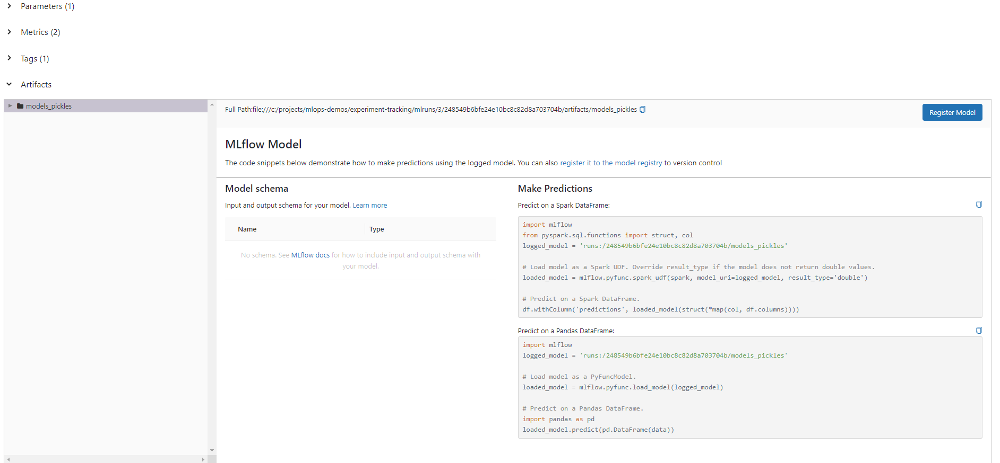

## Definition of Experiment Tracking
Experiment tracking (ET) is the process of tracking all the relevant information from an ***ML experiment***, which may include:


* Data
* Hyperparameters
* Metrics 
* ...

_Relevant information_ may vary depending on the experiment itself and its nature: experimenting with different data sources, tuning hyperparameters, or any other kind of experiment with different kinds of results to track.

## Why is Experiment Tracking important?

There are 3 main reasons for tracking experiments:
* ***Reproducibility***: reproducing the results of an experiment is needed in order to verify our results.
* ***Organization***: Whether you're working with a team or independently, having a well-organized system for storing and locating your work is crucial. It ensures that everyone on the team can easily access necessary information, and if you need to refer back to previous work, having it organized can greatly assist you.
* ***Optimization***: With the use of experiment tracking tools, we can develop more effective workflows and automate certain steps that are typically carried out manually.


## Using Spreadsheets to document experements
This approach falls short for any reasonably complex project:

* Prone to errors: Manually copying and pasting results is inconvenient and likely to result in mistakes in the long run. Even if you automate data input, problems may arise later on.
* Lack of standardization: Different data scientists may use varying formats for documenting their results, and crucial information such as hyperparameters may be absent or misconstrued if the data scientist is not careful with their template.
* Poor visibility and collaboration: Spreadsheets are not ideal for collaboration, and merging two separate spreadsheets can be an extremely frustrating experience. A manager may become overwhelmed attempting to comprehend the various spreadsheets used by the team members, and locating specific results among different spreadsheets can be challenging.


## Introduction to MLflow

***[MLflow](https://mlflow.org/)*** is an open source platform (as Python package) for the machine learning lifecycle (building and maintaing ML models).

It encompasses 4 main modules:
* ***[Tracking](https://mlflow.org/docs/latest/tracking.html)***: It is our focus in this module, a.k.a, ET
* ***[Models](https://mlflow.org/docs/latest/models.html)***: packaging ML models that can be used in diverse serving environments.
* ***[Model Registry](https://mlflow.org/docs/latest/model-registry.html)***: used in managing models in MLflow. 
* ***[Projects](https://mlflow.org/docs/latest/projects.html)***: a format for packaging code in a reusable and reproducible way. Out of scope for this course.


## Tracking experiments with MLflow

The Tracking module allows us to organize our _experiments_ into _runs_. A ***run*** is a trial in a ML experiment. An ***experiment*** consists of multiple runs, and each run may keep track of:
* Parameters (both hyperparameters as well as any other relevant parameters such as data paths, etc)
* Evaluation metrics
* Metadata (e.g. tags for organizing your runs)
* Artifacts (e.g. visualizations)
* Models


In addition to the aforementioned data, MLflow also records extra details about the run, which include:

* Name of the file used for the experiment (source code)
* Git commit code version
* Start and end time of the experiment
* Author of the experiment


## MLflow Demo
Installing MLflow
You install MLflow by running:
```
pip install mlflow
```

Issues that might emerge when installing MLflow under windows:
* 'mlflow' is not recognized as an internal or external command.
  * Solution: adding this url C:\Users\[user name]\AppData\Roaming\Python\Python39\Scripts to the PATH env variable
* ImportError: cannot import name 'escape' from 'jinja2'
  * Solution: install an updated version of `Flask>=2.2.2`


Once you've installed MLflow, You may access the MLflow web UI by running the `mlflow ui` command from a terminal. 
However, you will need to provide a backend in order to save and retrieve experiment data. SQLite can be utlilized as a backend with the following command:

```
mlflow ui --backend-store-uri sqlite:///project-experiments.db
```

This will create a mlflow.db file in the folder your run the command from. You should now be able to access the web UI by browsing to http://127.0.0.1:5000


## Using MLflow with Jupyter Notebook

Recall that MLflow is a library that you import into your project to track and store the experiments/models.

To integrate MLflow into your project, follow the following steps:


* create a `models` subdirectory in the working directory where you run your notebook, so that MLflow can store the models.

You may copy [this notebook](https://github.com/DataTalksClub/mlops-zoomcamp/blob/main/01-intro/duration-prediction.ipynb) and update it accordingly.


* import the MLflow library and setting some parameters:

```python
import mlflow


mlflow.set_tracking_uri("project-experiments.db")
mlflow.set_experiment("text-classification")
```
   * `set_tracking_uri` is used to point to our DB file. The provided uri should match the uri you provided when you run the MLflow command from console.
   * `set_experiment` is used to specify the name of the experiments. Use the name you want.

   * When you run this cell, if the experiment did not exist before, MLflow will create it.

Write and run your code to load and prepare any data you may need noramlly. Then, once you're ready to fit a model, use a `with` statement block to wrap your code like this:

```python
#wrap your code with this
with mlflow.start_run():
    
    mlflow.set_tag("developer", "hamed")
    # Compute predicted probabilities
    alpha = 1
    mlflow.log_param("alpha", alpha)

    nb_model = MultinomialNB(alpha=1)
    nb_model.fit(X_train_tfidf, y_train)
    probs = nb_model.predict_proba(X_val_tfidf)

    # Evaluate the classifier
    auc, accuracy = evaluate_roc(probs, y_val)
    mlflow.log_metric("auc", auc)
    mlflow.log_metric("accuracy", accuracy)
```
* `mlflow.start_run()` returns the current active run, if one exists. The returned object is a [Python context manager](https://docs.python.org/2.5/whatsnew/pep-343.html), which means that we can use the `with` statement to wrap our experiment code and the run will automatically close once the statement exits.
* `mlflow.set_tag()` creates a key-value tag in the current active run.
* `mlflow.log_param()` logs a single key-value param in the current active run.
* `mlflow.log_metrics()` logs a single key-value metric, which must always be a number. MLflow will remember the value history for each metric.

## Viewing experiments on the web UI

After running your code, you can use the web UI to inspect your experiment and its runs. The experiments are listed in the left column, while each row in the main window corresponds to a single run. You have the option to modify parameters in your notebook, rerun the code, and then refresh the UI to view any new runs that have been added to your experiment.


# Model management

So far we've seen _Experiment Tracking_, which handles model architecture, training and evaluation. ***Model Management*** would be the next step in MLops and handles model versioning and deployment, as well as hardware scaling. In this block we will see how to use MLflow for Model Management.


## Model tracking

you could simply use a folder hierarchy for model management. However, this simple management approach is not practical and has many limitations
* ***Error prone***: manually renaming folders and files and moving them around will surely result in mistakes.
* ***No versioning***: manual versioning by choosing filenames also leads to many mistakes and it is very easy to mix things up.
* ***No model lineage***: iit is difficult to keep track how the models are created, what the hyperparams were, etc.

Let's see how MLflow helps in tracking models and artifacts

## Tracking artifacts

Besides parameters and metrics, MLflow can also track ***artifacts***, such as our model weights.

Tracking an artifact is just like tracking any other element in MLflow. The simplest way of model management is simply to track the model as an artifact. Here's the same Scikit-Learn code we saw before with a new line at the end:

```python
import pickle
# model tracking by maintaining artifacts
with mlflow.start_run():
    
    mlflow.set_tag("developer", "hamed")
    # Compute predicted probabilities
    alpha = 3
    mlflow.log_param("alpha", alpha)

    nb_model = MultinomialNB(alpha=alpha)
    nb_model.fit(X_train_tfidf, y_train)

    pickle.dump(nb_model, open('models/model.pkl', 'wb'))

    mlflow.log_artifact(local_path='models/model.pkl', artifact_path='models_pickles')

    probs = nb_model.predict_proba(X_val_tfidf)

    # Evaluate the classifier
    auc, accuracy = evaluate_roc(probs, y_val)
    mlflow.log_metric("auc", auc)
    mlflow.log_metric("accuracy", accuracy)
```

* `mlflow.log_artifact()` logs a local file or directory as an artifact.
  * `local_path` is the path of the file on disk.
  * `artifact_path` is the directory in `artifact_uri` to write to under mlflow.


## Model logging

The drawback of using artifact tracking for managing models is that it can be tedious task to locate a particular model, download the binary file, and develop the code to load it and perform predictions.

There's a better way of managing models. We'll use the sklearn code from before as an example; pay attention to the last line:

```python
import pickle
# # model tracking by logging model data and metadata
with mlflow.start_run():
    
    mlflow.set_tag("developer", "hamed")
    # Compute predicted probabilities
    alpha = 3
    mlflow.log_param("alpha", alpha)

    nb_model = MultinomialNB(alpha=alpha)
    nb_model.fit(X_train_tfidf, y_train)

    pickle.dump(nb_model, open('models/model.pkl', 'wb'))

    mlflow.sklearn.log_model(nb_model, 'models_pickles')

    probs = nb_model.predict_proba(X_val_tfidf)

    # Evaluate the classifier
    auc, accuracy = evaluate_roc(probs, y_val)
    mlflow.log_metric("auc", auc)
    mlflow.log_metric("accuracy", accuracy)
```

## Making predictions

Models logged using `log_model` function allows for generating code snippets next to the model artifacts to facilitate the process of making predictions with the logged models.

MLflow actually stores the model in a format that allows us to load it in different "flavors". For example, our  model can be loaded as an sklearn model or as a PyFuncModel.




logged_model = 'runs:/248549b6bfe24e10bc8c82d8a703704b/models_pickles'

```python
# Load model as a PyFuncModel.
loaded_model = mlflow.pyfunc.load_model(logged_model)
loaded_model
```
